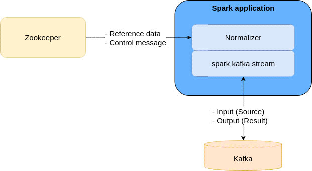

# Adenium Framework

엔진의 모든 Application은 Adenium Framework 기반에서 동작 합니다. Adenium은 Core engine의 동작을 제어 하기 위해 만들어 졌으며 주요 기능은 다음과 같습니다.

* Runtime application의 동작 제어
* Broadcast 데이터 관리
* 데이터 입출력 관리

Adenium은 Runtime application을 제어하기 위해 Zookeeper를 활용하고 모든 엔진의 입출력은 Kafka queue를 사용 합니다. 따라서 Core engine의 동작을 이해 하기 위해서는 Zookeeper, Kafka, Sprak, Adenium 간의 상호 동작을 이해 하여야 합니다.

