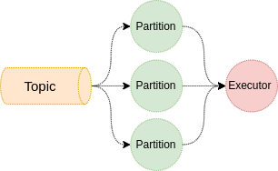

# Partitioning and Parallelization

### Kafka-based I/O flow&#x20;

엔진은 Kafka spark stream을 기반으로 동작 하며 Event driven한 처리를 위해 카프카 토픽을 입/출력 스트림으로 사용 합니다. 따라서 엔진의 병렬처리와 성능은 카프카 파티셔닝 전략과 밀접한 관계를 가지고 있습니다.

### Partitioning Strategy

분산 스트림 데이터의 병렬 처리를 위해서는 다양한 파티셔닝 전략이 필요 합니다. 파티셔닝 과정에서 데이터를 분배 하는 규칙에 따라 파티션의 재 배치가 발생 할 수 있습니다. 이를 셔플링이라고 하며 셔플링은 스트림 데이터 처리 성능에 밀접한 영향을 미치기 때문에 효율적인 셔플링 정책이 필요 합니다.&#x20;

엔진은 크게 두가지 셔플링 정책을 사용 할 수 있습니다.

* 라운드 로빈 방식: 특별한 파티셔닝 전략이 필요하지 않는 경우 기본적으로 사용하는 파니셔닝 전략 입니다. 모든 파티션에 이벤트가 고르게 분산 되기 때문에 전체적으로 고른 처리 성능을 보장 할 수 있습니다. 모든 엔진은 라운드 로빈 방식을 기본 전략으로 사용 하고 있습니다.
* ID 기반의 셔플링: 로그별로 특별한 처리가 필요 하거나 Flow control을 위해 임의로 파티셔닝 전략을 변경 할 수 있습니다. (shuffle 옵션 참조)
* 이상적인 분산 처리를 위해서는 Kafka의 파티션 수와 Executor 수를 일치 시키는 것이 좋습니다.

* 경우에 따라서는 파티션수 보다 적은 Executor를 할당 할 수도 있습니다.

* 파티션수 보다 많은 Executor를 할당 할 경우 리소스 낭비가 발생 합니다.

### Threshold & Graph의 특별한 처리

Threshold와 Graph 탐지 엔진은 단일 트가 아닌 복수의 이벤트를 누적하여 상관 관계를 분석 하여야 합니다.  분산처리 환경에서는 이벤트의 처리가 물리적으로 독립된 머신에서 수행 되기 때문에 각각의 머신(map)에서 처리한 결과를 다시 수집(reduce)하여 분석 하여야 합니다. 이러한 reduce 과정은 많은 리소스를 필요로 합니다. 때문에 Threshold 엔진은 Reduce 과정 없이 이벤트의 관계를 분석하기 위해 두 가지 전략을 사용 합니다.&#x20;

* **Single partition & Single core:** Live detector의 출력 스트림이자 Threshold의 입력 스트림으로 사용되는 Filtered 파티션의 수를 1개로 제한하고 Threshold detector의 코어수를 1개로 제한 하여 분산 처리를 하지 않도록 하는 전략
* **Id 기반의 파티셔닝:** 테넌트 ID 또는 Company id를 Key로 사용하여 같은 그룹(테넌트, 컴퍼니 등)에서 발생한 이벤트를 하나의 파티션에 적재하여 분산처리

Threshold 엔진은 Single partition전략을 권장 합니다  자세한 설명은 [Threshold analyzer을 참고 하십시오.](../threshold-analyzer.md)
