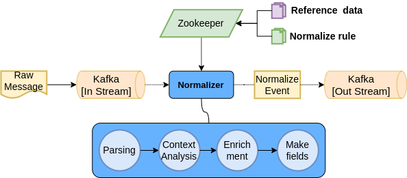

# Normalizer

### 정규화

SIEM이 데이터를 수집할 때 가장 큰 문제는 다양한 로그 형식을 극복하는 것 입니다. SIEM은 본질적으로 많은 레이어에서 데이터를 가져옵니다.\[ 서버, 방화벽, 네크워크 라우터, 데이터베이스, IoT Sensor .. ] 이 것들은 모두 각기 다른 포멧으로 로그를 기록 합니다. 때문에 다양한 소스 및 이벤트의 상관 관계를 해석하기 위해서 데이터의 포멧을 표준화 하는 작업이 필요 합니다. 이러한 작업을 정규화 라고 합니다.


정규화는 원시 이벤트 데이터의 구문을 분석하여 중요하고 의미있는 개별 필드를 추출하고 추출한 필드를  읽기 가능한 구조화된 형식으로 만드는 데이터 준비 작업 입니다.


### 정규화 엔진

### 정규화 의 단계

1. 전송 포멧 파싱: 전송 포맷에 따라 추가된 부가 정보와 Payload를 추출합니다.
2. Message format 식별: 사전 정의된 패턴으로 유입된 로그를 파싱 하기 위한 정규화 룰 집합을 선택합니다.
3. Parse: Payload를 파싱하여 의미 있는 구문을 추출 하고 필드를 생성 합니다. \[[원본 필드](../field.md#field-1)]
4. Reference: 파싱된 값을 기준으로 특정 데이터 테이블을 Lookup 하여 필드를 생성 합니다. \
   이 과정에서는 테이블 필드 명에 따라 원본 필드의 치환이 발생 할 수 있습니다. \[[파생/치환 필드](../field.md#field-1)]
5. Enrichment: 필드의 값을 변경 하거나 사전 정의된 값을 추가 합니다.
6. 정규화 이벤트 생성:  Code table을 참조하여 최종 필드 정규화 이벤트로 생성 합니다.[\[정규화 이벤트\]](normalize-event.md)
