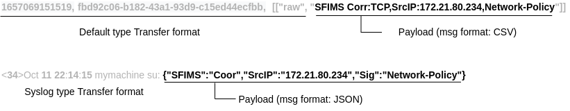

# Log Message

### Log Message를 표현하는 용어

정규화 엔진을 설명 하기 전에 엔진에서 사용하는 용어를 명확히 할 필요가 있습니다. 아래 용어를 혼용하여 사용하지 마십시오.

* Payload:  Device에서 생성한 가공되지 않은 순수한 Message
* Collect event: Kafka 원본 메세지 토픽에 저장되는 이벤트 \[[Collect event](../../getting-started/overview/event.md#collect-event)]
* Transfer format: Payload를 전송하기 위한 포맷 ( Collect event format, syslog format )
* Message format: Payload의 포멧을 지칭한다. Json, CEF, LEEF, CSV, TSV등 형식이 있거나 정해진 형식 없는 텍스트

#### \[ Log Message의 예 ]

